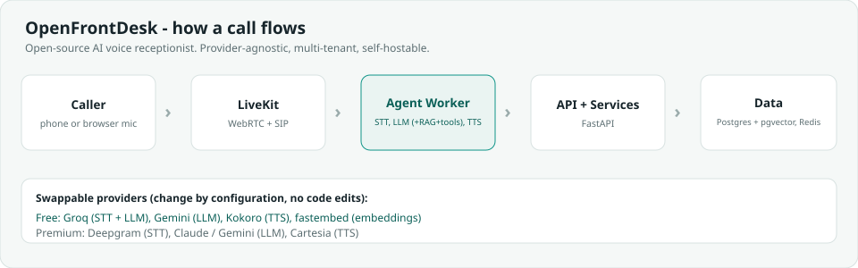

<div align="center">

# OpenFrontDesk

**The open-source AI voice receptionist for small businesses.**

Answers every call 24/7, books appointments, answers questions from your own documents, captures leads,
and hands off to a human. Self-hostable, provider-agnostic, multi-tenant, and tested.



</div>

> Try it in about two minutes (no API keys needed): run `make demo`, then open
> `http://localhost:8000/app` and sign in with `demo@openfrontdesk.local` / `demodemo12`.
<!-- Add a screen recording at docs/media/demo.gif and uncomment: -->
<!--  -->

---

## Why this exists

Small businesses miss 30 to 40 percent of inbound calls, and every missed call is lost revenue. A human
receptionist is expensive and only works business hours. Commercial voice-AI platforms (Vapi, Retell,
Bland) are closed and costly; the existing open-source projects are thin demos that are single-tenant,
locked to one provider, untested, and without a dashboard.

OpenFrontDesk is the missing middle: a production-grade platform you can run for roughly zero dollars a
month on infrastructure you already own, and upgrade to premium providers per client once it is earning.

## What makes it production-grade (not a demo)

- **Provider-agnostic.** Swap STT / LLM / TTS between free (Groq, Gemini, Kokoro) and premium (Deepgram,
  Cartesia, Claude) with a configuration change, no code edits.
- **An eval / call-simulation harness.** A synthetic caller talks to the agent and scorers grade booking
  success, grounding (anti-hallucination), contact capture, and latency, gated in CI.
- **Multi-tenant from day one.** Many businesses, isolated data, per-tenant knowledge and configuration.
- **Grounded retrieval (RAG).** Answers come from the business's own documents; if it does not know, it
  takes a message instead of guessing.
- **Operations built in.** JWT auth, per-tenant rate limiting, PII-redacted logs, a metrics endpoint, and
  an audit log.
- **Automations.** Signed, retried webhooks (lead, booking, call, knowledge events) and a key-authenticated
  REST API, with ready-to-import n8n workflows: leads to Google Sheets and Slack, call transcripts by
  email, and the same trained agent answering on WhatsApp. Works with Zapier and Make too.
  See [docs/17-automations.md](docs/17-automations.md).
- **Custom solutions pipeline.** A contact form for companies that want a tailored setup (WhatsApp, HR
  helpdesk, integrations), with an instant prefilled booking link, email and Slack notifications, and an
  admin inbox to track each request to a call. See
  [docs/18-contact-and-personalization.md](docs/18-contact-and-personalization.md).
- **Free to demo.** Testing uses the browser microphone over LiveKit's free tier; a real phone number is
  only added at go-live.

## Quickstart

Prerequisites: Docker. For the live voice call you also need free
[Groq](https://console.groq.com) and [LiveKit](https://cloud.livekit.io) keys; they are not needed for
the RAG or dashboard demo.

```bash
cp .env.example .env
make demo    # starts Postgres + Redis + API, creates tables, seeds a demo dental clinic
```

Then open:

- `http://localhost:8000/app` - dashboard (login `demo@openfrontdesk.local` / `demodemo12`)
- `http://localhost:8000/docs` - full API (Swagger)
- `http://localhost:8000/test` - talk to the agent in the browser (needs LiveKit and Groq keys)
- `http://localhost:8000/widget-demo` - the embeddable chat widget
- `http://localhost:8000/contact` - the custom-solutions request form

If port 8000 is already in use, set `API_HOST_PORT=8080` in `.env`. On Windows without `make`, run
`scripts/demo.ps1` (or the commands in the `Makefile` demo target).

Run the eval harness:

```bash
python -m eval --validate    # list scenarios (no keys required)
python -m eval --run         # run them (needs GROQ_API_KEY and a seeded database)
```

## Free vs. premium (same code, configuration switch)

| Layer | Free (default) | Premium |
|---|---|---|
| Speech-to-text | Groq Whisper | Deepgram Nova-3 |
| Language model | Groq Llama / Gemini Flash | Claude / Gemini (paid) |
| Text-to-speech | Kokoro (self-hosted) | Cartesia Sonic-3 |
| Embeddings | fastembed (local) | Gemini |
| Telephony | none (browser mic) | Telnyx / Twilio |

All-in premium is roughly 5 to 10 cents per minute, so a three-minute call costs cents, while a human
receptionist costs 15 to 25 dollars an hour.

## Project layout

```
src/ofd/       api, agent (voice worker), rag, services, providers, models
eval/          scenario suite, scorers, and the text-mode runner (the eval harness)
docs/          one file per aspect (architecture, RAG, costing, security, and so on)
integrations/  ready-to-import n8n workflows
deploy/        Dockerfiles and nginx
scripts/       init_db.py, seed_demo.py, demo helpers
progress.md    living build log
```

Start with [docs/00-overview.md](docs/00-overview.md) and
[docs/02-architecture.md](docs/02-architecture.md).

## Roadmap

| Phase | Focus | Status |
|---|---|---|
| 0 | Foundations (API, database, providers) | Done |
| 1 | Talking agent (browser voice) | Done |
| 2 | Useful agent (RAG, tools, booking) | Done |
| 3 | The product (auth, tenancy, dashboard) | Done |
| 4 | Production-grade (eval, metrics, quotas, security) | In progress |
| 5 | Launch (hosted demo, phone number) | Planned |

Live detail is in [progress.md](progress.md).

## Contributing

Contributions are welcome. See [CONTRIBUTING.md](CONTRIBUTING.md). Security policy:
[SECURITY.md](SECURITY.md).

## License

[Apache-2.0](LICENSE).
